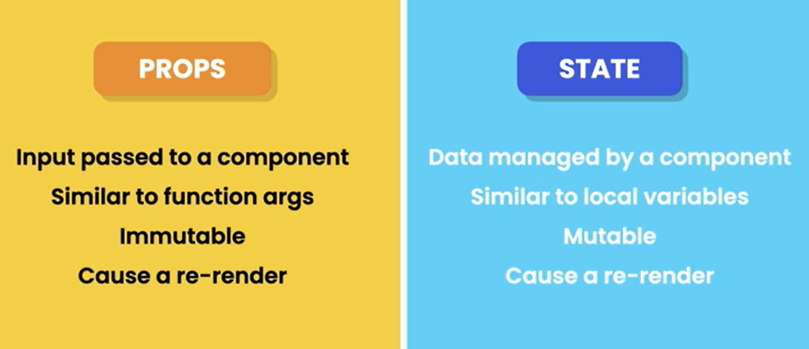

# Native
## Some notes:  
- always follow Pascal naming convention (MyMessage())

## Some terms:  
- JSX: JavaScript XML  

## 1. Setting up development environment  
- needed: node.js  

## 2. Creating a react app  
Methods:  
1. Create React App (CRA)  
2. Vite (Popular)  
> npm create vite@latest / npm create vite@4.1.0  
>> name  
>> select framework: React  
>> select a variant: Typescript  

> After app created:  
>> cd project-name  
>> npm install  
>> npm run dev (to run server)  

> Install new library:  
>> npm i bootstrap@latest / npm i bootstrap@5.2.3  

## 3. Project structure
...

## 4. Create a React Component  
> function based component  

## 5. React Ecosystem  
|- UI  
|- Routing  
|- HTTP  
|- Managing app state  
|- Internationalization  
|- Form validation  
|- Animations  

## 6. Building Componsnts  
1. Rendering markup with JSX 
2. Managing state
3. Psssing input via Props
4. Debugging

## 7. React-Works
### i. Creating a ListGroup Component
### ii. Fragments
### iii. Rendering Lists
### iv. Handling Events
### v. Managing state
### vi. Passing Data via Props
### vii. Passing Functions via Props
### viii. Props vs State
  

### ix. Passing children
### x. Inspecting Components with 'React Development Tools' Chrome-extension
